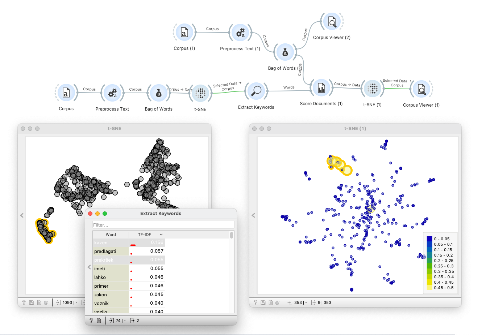

Projekt sofinancira Evropska Unija.

# Semantčni analizator

V okviru projekta semantični analizator izdelujemo orodje, s katerim analiziramo besedila (na primer
zakonske dokumente), ugotavljamo, kateri pojmi v dokumentih ključno opredeljujejo vsebino
dokumenta, in na podlagi obstoječih ter novih pojmov gradimo besednjake. Hkrati orodje omogoča
iskanje dokumentov, ki po vsebini ustrezajo pojmom iz besednjaka. Pojmi v besednjaku pri tem
postanejo vezni člen med več dokumenti in tako uporabnik med slednjimi odkriva soodvisnosti. Na ta
način lahko na primer poiščemo tiste zakonske dokumente, ki se sklicujejo na nek vir podatkov (register,
evidenca, seznam).

Orodje je odprtokodno in poleg funkcionalnosti, opisanih v naročilu, vključuje tudi
standardne funkcije s področja analitike besedil, vizualizacije in strojnega učenja. Vhodni viri meta
podatkov z ontologijami pojmov bodo dostopni v zapisu izdelanem v okolju Protege Desktop 5.2.0. 
Vsa razvita programska koda v projektu je prosto
dostopna in dosegljiva na tem repozitoriju in repozitoriju [Orangeovega dodatka za analizo besedil](https://github.com/biolab/orange3-text). 
Orodje vključuj grafični programski vmesnik in
možnosti kombiniranja razvitih metod.

## Skupnost uporabnikov

Skupnost je vzpostavljena na tem repozitoriju v [zavihku Issues](https://github.com/biolab/text-semantics/issues). Uporabnik, ki želi sodelovati v skupnosti, lahko:

- Pregleduje obstoječe razprave, ki jih najde na [zavihku Issues](https://github.com/biolab/text-semantics/issues).
- Komentira in sodeluje v obstoječih razpravah. To stori tako, da klikne na obstoječo razpravo v seznamu, in v tekstovnem polju na dnu okna doda svoj komentar.
- Odpre novo razpravo. Za odpiranje nove razprave 1) uporabi gumb New issue v zgornjem desnem kotu strani, 2) vpiše željeni komentar v tekstovno polje in 3) objavi svoj komentar s klikom na gumb Submit new issue.

Za komentiranje in odpiranje razprave mora uporabnik ustvariti račun na platformi GitHub.

